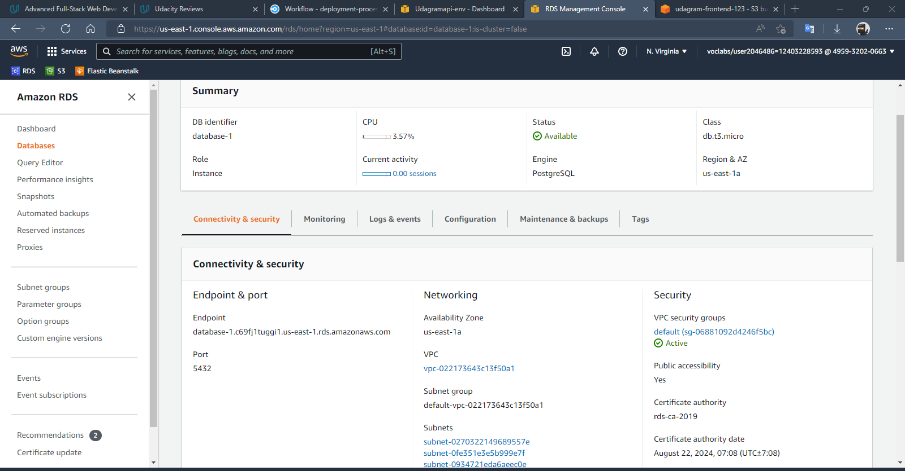
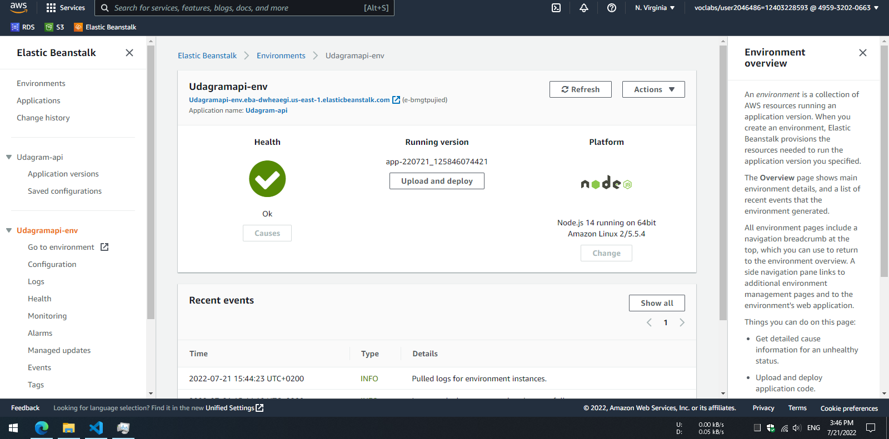
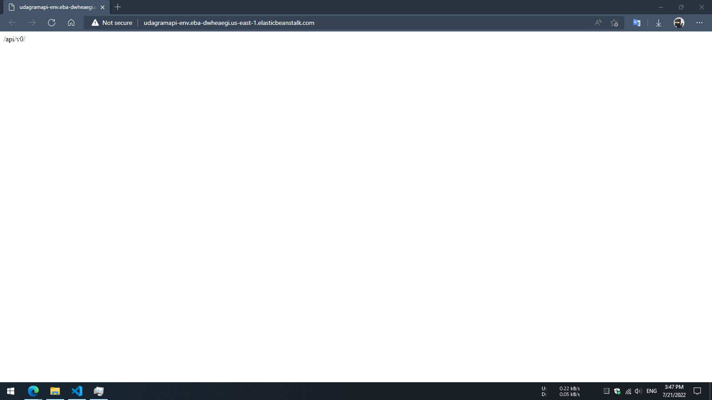
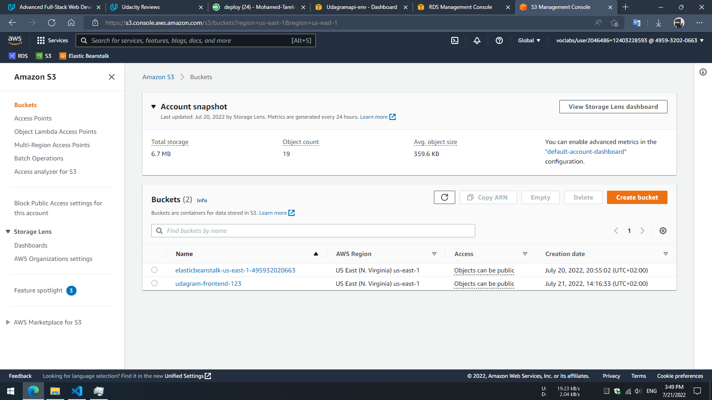
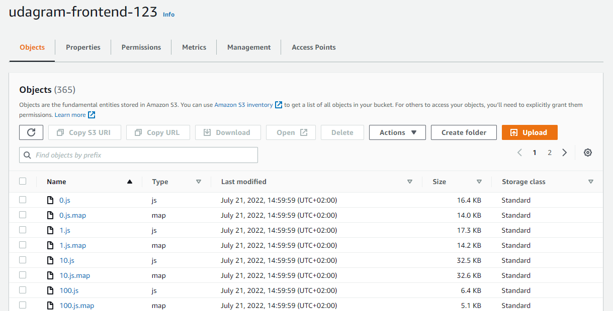
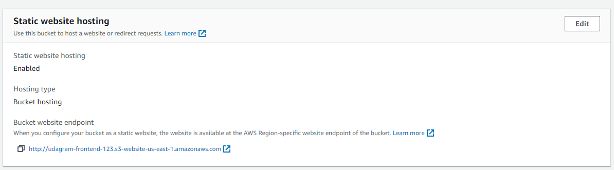
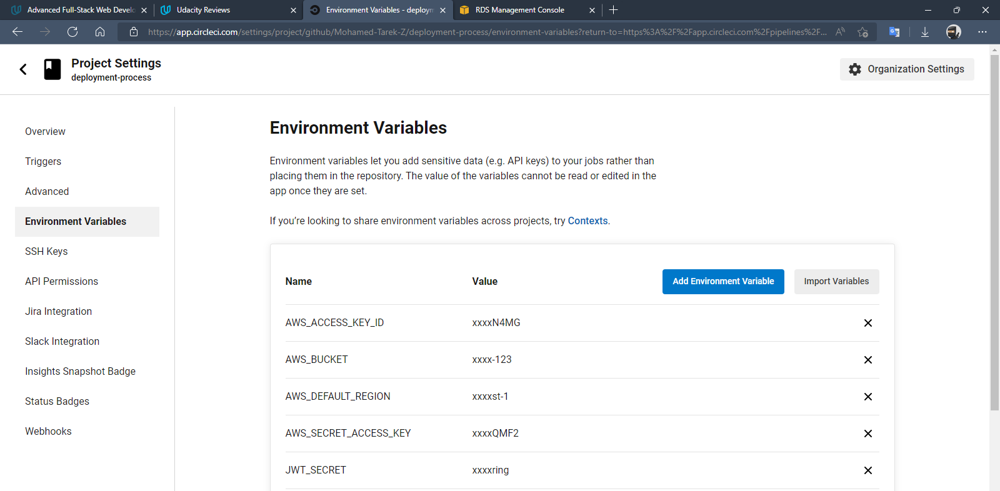
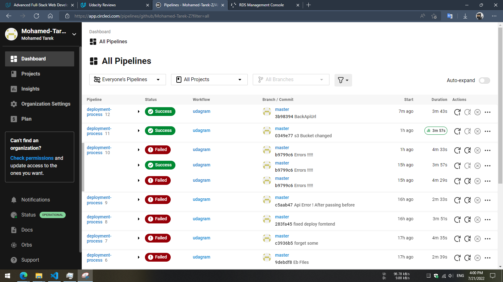

# Udagram
this is a full stack application that is hosted on AWS. and you can be accessed
[Here](http://udagram-frontend-123.s3-website-us-east-1.amazonaws.com/home)

## CircleCI status
[](https://dl.circleci.com/status-badge/redirect/gh/Mohamed-Tarek-Z/deployment-process/tree/master)

### Dependencies

```
- Node v14.15.1. 

- npm 6.14.8.

- AWS CLI.

- A RDS database running Postgres.

- A S3 bucket for hosting the Front-End.

- A ElasticBeanstalk to run the Back-End.
```

## Built With
- [Node] Javascript Runtime
- [Angular] Single Page Application Framework used for building Front End.
- [Express] Javascript API Framework 

### Installation and running

Provision the necessary AWS services needed for running the application:

1. In AWS, provision a publicly available RDS database running Postgres.
2. In AWS, provision a s3 bucket for hosting the uploaded files.
3. Export the ENV variables needed or use a package like [dotnev].
4. From the root of the repo, you can run these commands to install the Dependencies `api:install` of the api
5. From the root of the repo, you can run these commands to install the Dependencies `frontend:install` of the front End
6. From the root of the repo, you can run these commands to build `api:build`.
7. From the root of the repo, you can run these commands to build `frontend:build`.
8. From the root of the repo, you can run these commands to start `api:start`.
9. From the root of the repo, you can run these commands to start `frontend:start`.

## Testing

This project contains two different test suite: unit tests and End-To-End tests(e2e). Follow these steps to run the tests.

1. `cd udagram/udagram-frontend`
2. `npm run test`
3. `npm run e2e`

There are no Unit test on the back-end

### Unit Tests:

Unit tests are using the Jasmine Framework.

### End to End Tests:

The e2e tests are using Protractor and Jasmine.


# screenshots
## RDS

## ElasticBeanstalk


## S3




## CircleCI

